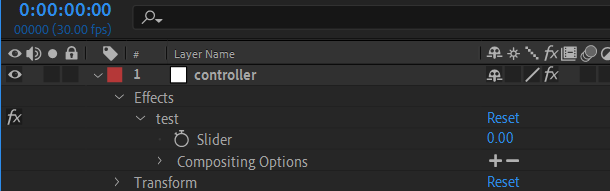

# ratatat

| [Demo]() | [Installation](#installation) | [Usage](#usage) | [API](#api) | [Examples](#examples) |
| -------- | :---------------------------: | :-------------: | :---------: | :-------------------: |


### Vue component to easily turn any Lottie animation into a dynamic progress/loading bar:


# Installation

```bash
npm i ratatat
```

# Usage

Ratatat uses a Slider Expression Control's value to dictate the progress bar status. You'll need a Lottie file with a single Slider Control (on any layer) which controls the elements you want to animate, then at least supply the name of the layer and Slider, the Lottie file itself, and the current value to the component:

```html
<!-- Inside a .vue file -->
<template>
  <Ratatat
    layer="MasterNull"
    slider="Slider Control 1"
    :animation-data="myAnimationFile"
    :percent="40"
  />
</template>

<script>
export default {
  components: {
    Ratatat: require("ratatat").default,
  },
  data: () => ({
    myAnimationFile: require("@/assets/someLottieFile.json"),
  })
}
```

### Why would I use this?

Lottie is great and using the `lottie_api` is also great, but there's no easy way to tween from one numeric value to another. In the event you want a nice, custom progress indicator which has a smooth transition from step to step, all you need to do is use this component and change the `:percent` prop, which will trigger an eased animation from the previous to new value.

# API

## Props

| Property       | Type   | Default  | Required |                                                                                     Description |
| :------------- | :----- | :------- | :------- | ----------------------------------------------------------------------------------------------: |
| animation-data | Object | null     | **Yes**  |                                                              The parsed Lottie JSON file to use |
| percent        | Number | 0        | **Yes**  |                                                               The current value between 0 - 100 |
| layer          | String |          | **Yes**  |                                                                  Name of the AE layer to target |
| slider         | String |          | **Yes**  |                                                    Name of the slider within AE layer to target |
| duration       | String | 400      |          |                                                                    Any valid CSS timing (ms, s) |
| timing         | String | in-quart |          | [Functional Easing preset](https://github.com/CharlotteGore/functional-easing#easerusingpreset) |
| speed          | Number | 1        |          |                                                                        Speed of Lottie playback |
| direction      | Number | 1        |          |                                                                     1 is forward, -1 is reverse |
| height         | String | 100%     |          |                                                                                   Any valid CSS |
| width          | String | 100%     |          |                                                                                   Any valid CSS |

## Events

| Event      | Value  |                                               Description |
| :--------- | :----- | --------------------------------------------------------: |
| @update    | Number | The reactive value of the slider within (includes easing) |
| @start     |        |             Fires on first frame of easing between values |
| @end       |        |              Fires on last frame of easing between values |
| @mounted   |        |           Fires when component finished mounted lifecycle |
| @complete  |        |                      Fires on Lottie's `onComplete` event |
| @DOMLoaded |        |                       Fires on Lottie's `DOMLoaded` event |
| @destroyed |        |   Fires on Lottie's `destroy` and Vue destroyed lifecycle |

# Examples

A Lottie file where the master slider is within a layer named `controller`, and slider named `test`:



```html
<template>
  <Ratatat
    layer="controller"
    slider="test"
    :animation-data="myAnimationFile"
    :percent="progressValue"
  />
</template>

<script>
export default {
  components: {
    Ratatat: require("ratatat").default,
  },
  data: () => ({
    progressValue: 0,
    myAnimationFile: require("@/assets/someLottieFile.json"),
  })
}
```

Easing occurs upon reassigning prop `percent` value:

```js
// eases from 0 - 20
this.progressValue = 20;

// eases from 20 - 70
this.progressValue = 70;
```

---

The same Lottie file as above with custom easing, duration, and realtime annotation of eased percentage:

```html
<template>
  <div class="display-wrapper">
  <Ratatat
    layer="controller"
    slider="test"
    :animation-data="myAnimationFile"
    :percent="progressValue"
    @update="(val) => (score = val)"
    :duration="600"
    timing="in-quint"
  />
  <!-- The below score variable is reassigned as ratatat changes it's slider value via @update -->
  <span>{{`Loading at ${score}%`}}</span>
  </div>
</template>

<script>
export default {
  components: {
    Ratatat: require("ratatat").default,
  },
  data: () => ({
    progressValue: 0,
    score: 0,
    myAnimationFile: require("@/assets/someLottieFile.json"),
  })
}
```
